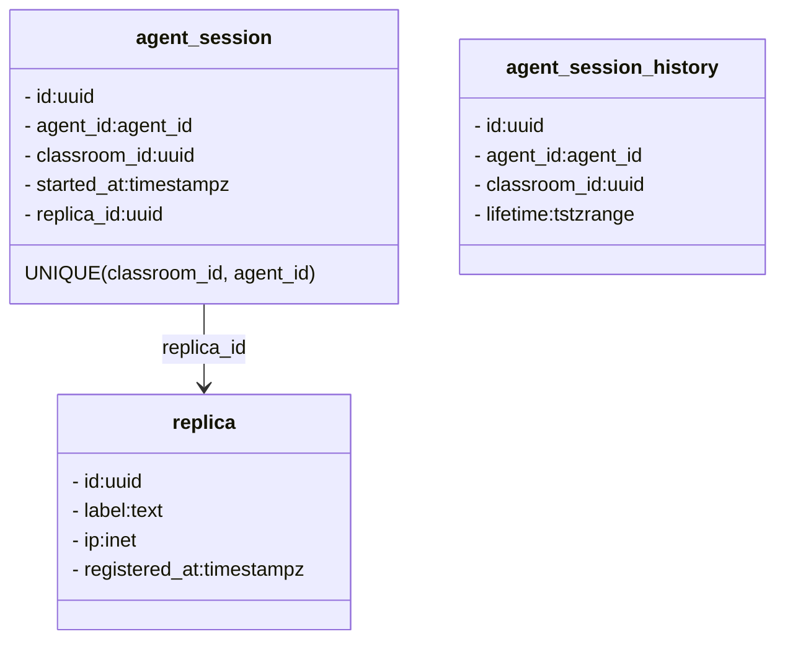

# Database schema

```mermaid
classDiagram
    class agent_session {
        - id:uuid
        - agent_id:agent_id
        - classroom_id:uuid
        - started_at:timestampz
        - replica_id:uuid
        UNIQUE (classroom_id, agent_id)
    }

    class agent_session_history {
        - id:uuid
        - agent_id:agent_id
        - classroom_id:uuid
        - lifetime:tstzrange
    }

    class replica {
        - id:uuid
        - label:text
        - ip:inet
        - registered_at:timestampz
    }

    agent_session -->  replica : replica_id
```
