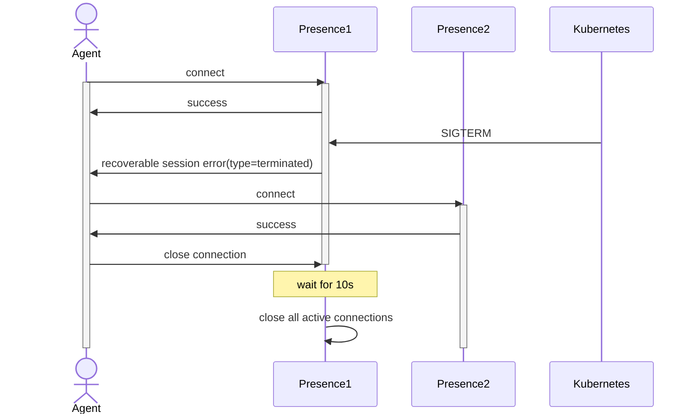
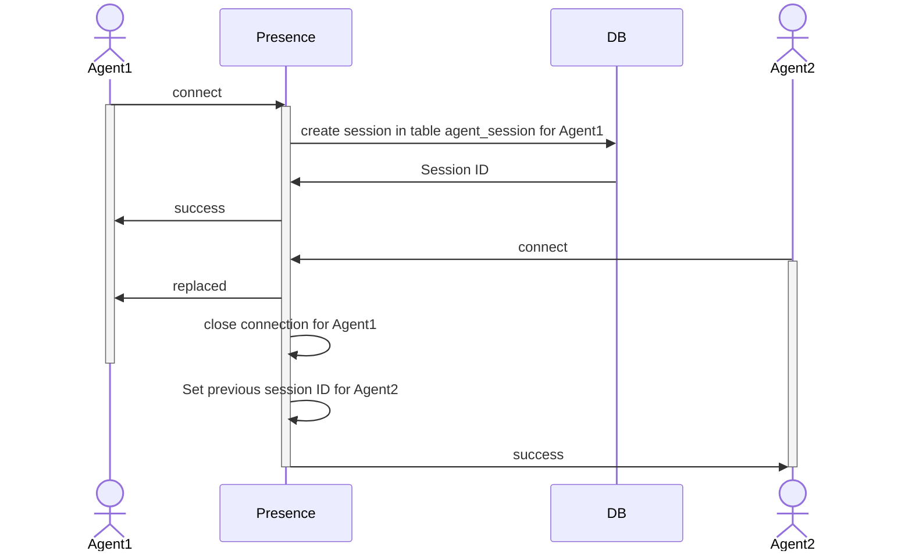
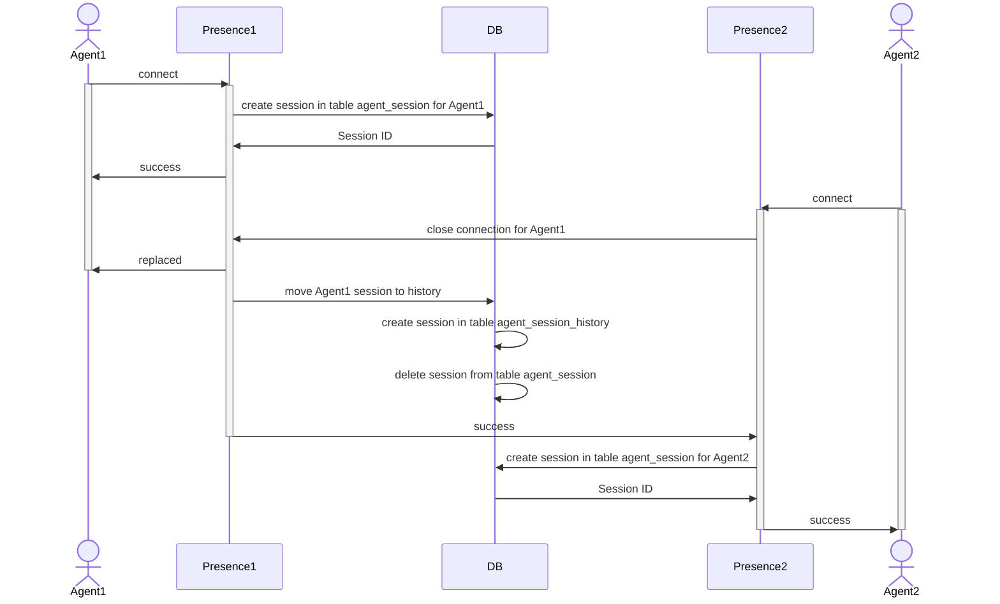
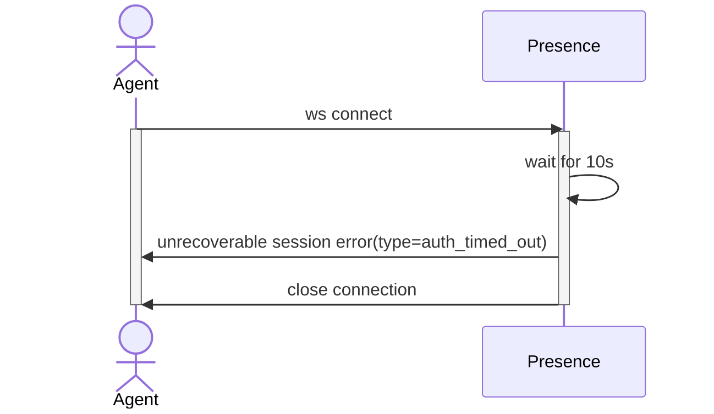
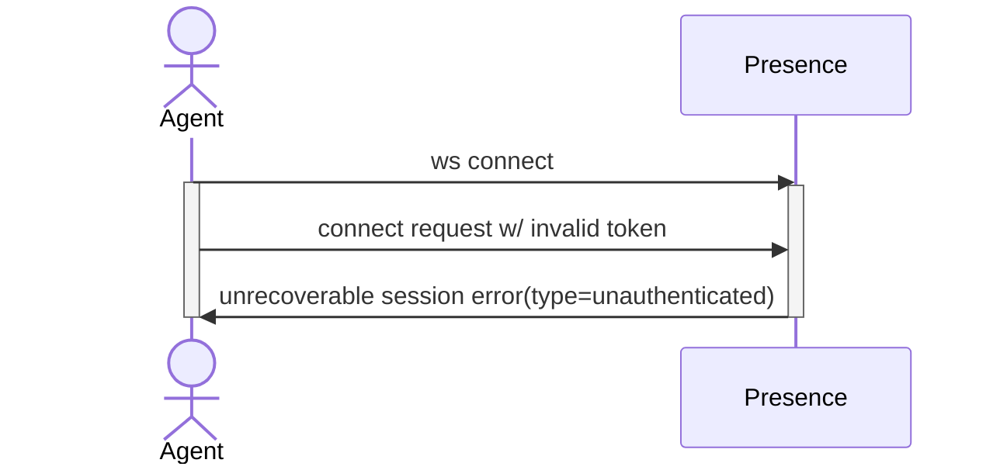
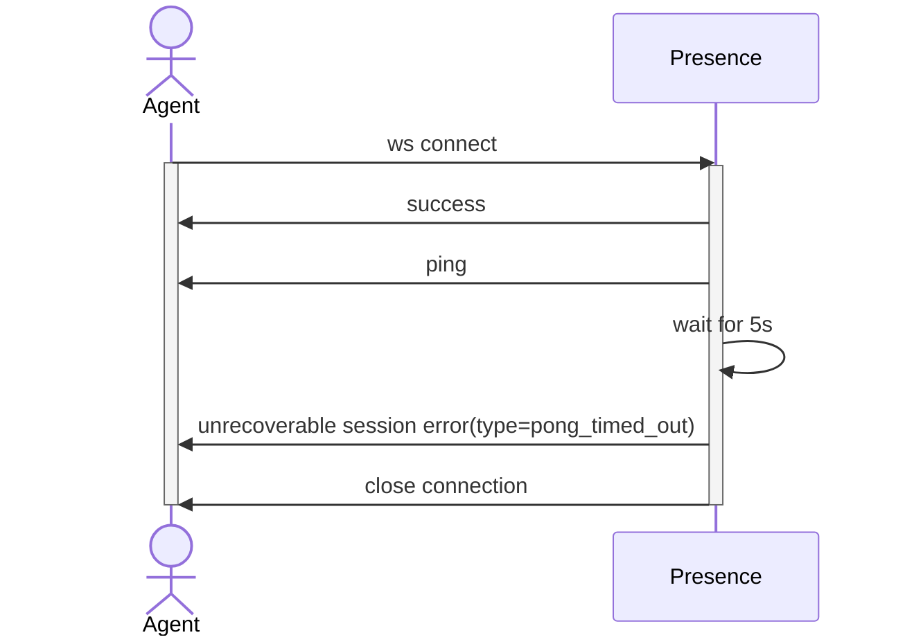

# Errors

## Recoverable session errors

### `terminated`

Occurs when the server is rebooted (graceful shutdown)

| Attribute       | Type   | Description                 |
|-----------------|--------|-----------------------------|
| type            | string | "recoverable_session_error" |
| payload[type]   | string | "terminated"                |
| payload[title]  | string | "terminated"                |
| payload[status] | int    | 422                         |

## Unrecoverable session errors

### `replaced`

Occurs when the agent opens the second session

| Attribute       | Type   | Description                   |
|-----------------|--------|-------------------------------|
| type            | string | "unrecoverable_session_error" |
| payload[type]   | string | "replaced"                    |
| payload[title]  | string | "replaced"                    |
| payload[status] | int    | 422                           |

#### On the same replica

#### On another replica

### `auth_timed_out`

Occurs when the server didn't receive the [connect_request](/session/api.html#connect-request) from the client at a given period of time

| Attribute       | Type   | Description                   |
|-----------------|--------|-------------------------------|
| type            | string | "unrecoverable_session_error" |
| payload[type]   | string | "auth_timed_out"              |
| payload[title]  | string | "auth_timed_out"              |
| payload[status] | int    | 422                           |

### `unauthenticated`

Occurs when the server didn't receive a valid token from the client

| Attribute       | Type   | Description                   |
|-----------------|--------|-------------------------------|
| type            | string | "unrecoverable_session_error" |
| payload[type]   | string | "unauthenticated"             |
| payload[title]  | string | "unauthenticated"             |
| payload[status] | int    | 401                           |

### `pong_timed_out`

Occurs when the server didn't receive the `PONG` message from the client at a given period of time

| Attribute       | Type   | Description                   |
|-----------------|--------|-------------------------------|
| type            | string | "unrecoverable_session_error" |
| payload[type]   | string | "pong_timed_out"              |
| payload[title]  | string | "pong_timed_out"              |
| payload[status] | int    | 422                           |

