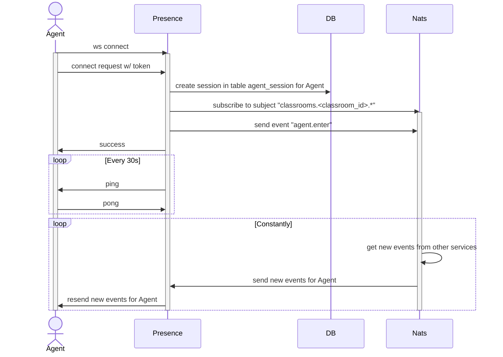
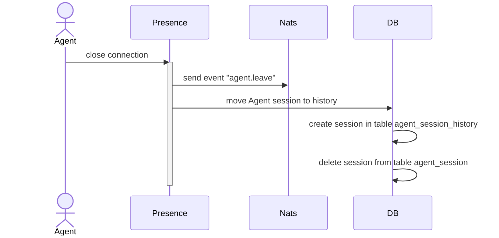

# Events

### `agent.enter`

Arrives when someone enters the classroom

Subject: `classrooms.{:CLASSROOM_ID}.presence`

Attribute | Type   | Optional  | Description
----------| ------ |-----------| -----------
type      | string |           | "event"
label     | string |           | "agent.enter"
payload   | string | +         | Agent ID

### `agent.leave`

Arrives when someone leaves the classroom

Subject: `classrooms.{:CLASSROOM_ID}.presence`

Attribute | Type   | Optional  | Description
----------| ------ |-----------| -----------
type      | string |           | "event"
label     | string |           | "agent.leave"
payload   | string | +         | Agent ID

