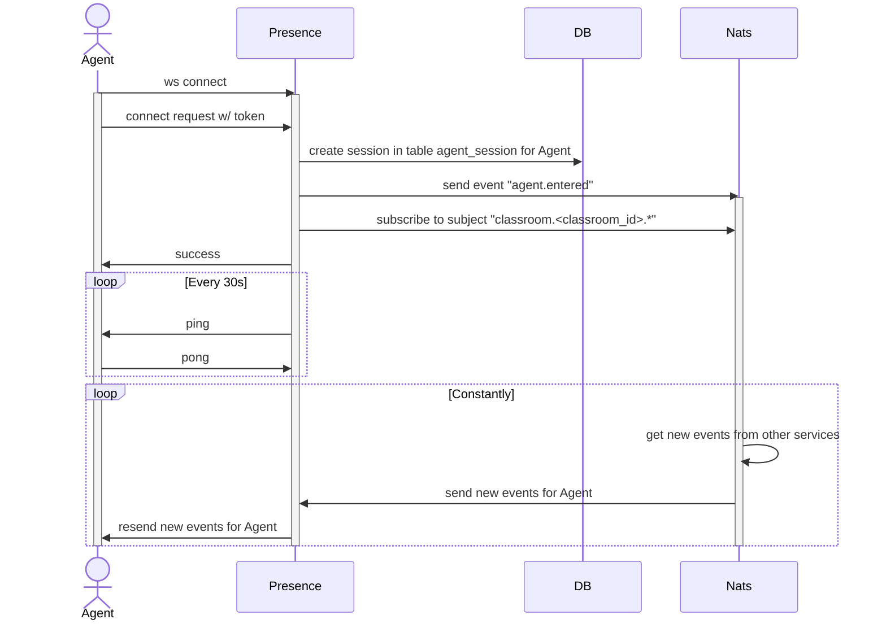
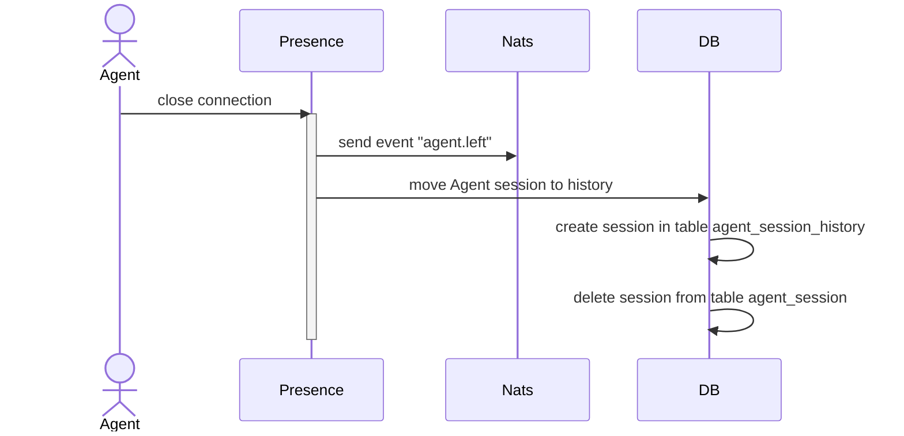

# Events

### `agent.entered`

Arrives when someone enters the classroom

Subject: `classroom.{:CLASSROOM_ID}.agent`

| Attribute | Type   | Description          |
|-----------|--------|----------------------|
| id        | object | Event ID             |
| payload   | object | Payload of the event |


#### Event ID

| Attribute   | Type   | Description |
|-------------|--------|-------------|
| entity_type | string | "agent"     |
| operation   | string | "entered"   |
| sequence_id | int    | Session ID  |

#### Payload

| Attribute   | Type   | Description |
|-------------|--------|-------------|
| version     | string | "v1"        |
| entity_type | string | "agent"     |
| label       | string | "entered"   |
| agent_id    | string | Agent ID    |

#### Example

```json
{
    "id": {
        "entity_type": "agent",
        "operation": "entered",
        "sequence_id": 1
    },
    "payload":{
        "version": "v1",
        "entity_type": "agent",
        "label": "entered",
        "agent_id": "dev.testing01.svc.foxford.ru"
    }
}
```



### `agent.left`

Arrives when someone leaves the classroom

Subject: `classroom.{:CLASSROOM_ID}.agent`

| Attribute | Type   | Description          |
|-----------|--------|----------------------|
| id        | object | Event ID             |
| payload   | object | Payload of the event |


#### Event ID

| Attribute   | Type   | Description |
|-------------|--------|-------------|
| entity_type | string | "agent"     |
| operation   | string | "left"      |
| sequence_id | int    | Session ID  |

#### Payload

| Attribute   | Type   | Description |
|-------------|--------|-------------|
| version     | string | "v1"        |
| entity_type | string | "agent"     |
| label       | string | "left"      |
| agent_id    | string | Agent ID    |

#### Example

```json
{
    "id": {
        "entity_type": "agent",
        "operation": "left",
        "sequence_id": 1
    },
    "payload":{
        "version": "v1",
        "entity_type": "agent",
        "label": "left",
        "agent_id": "dev.testing01.svc.foxford.ru"
    }
}
```


