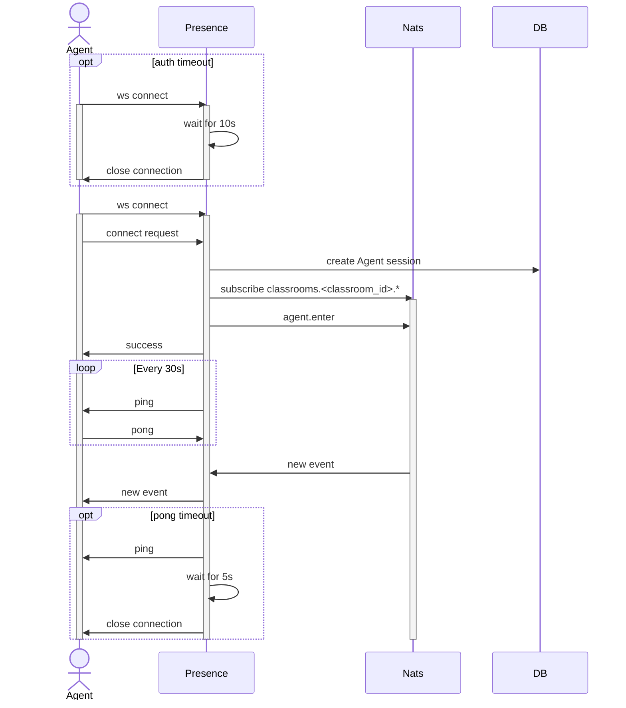
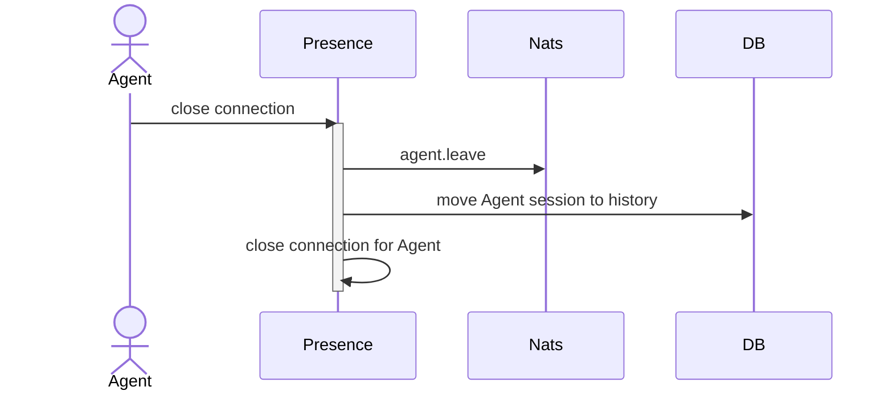
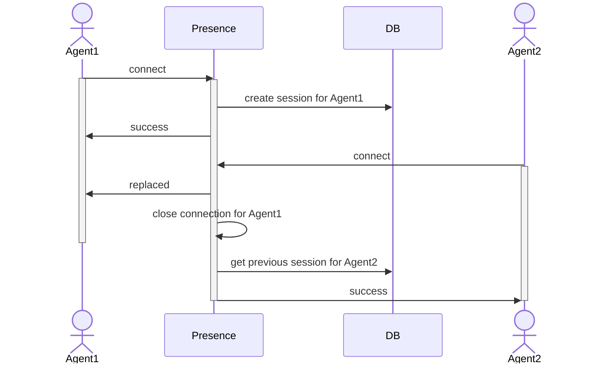
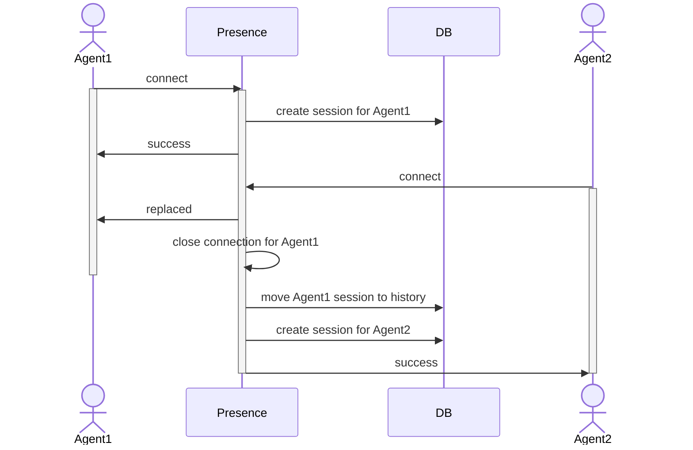
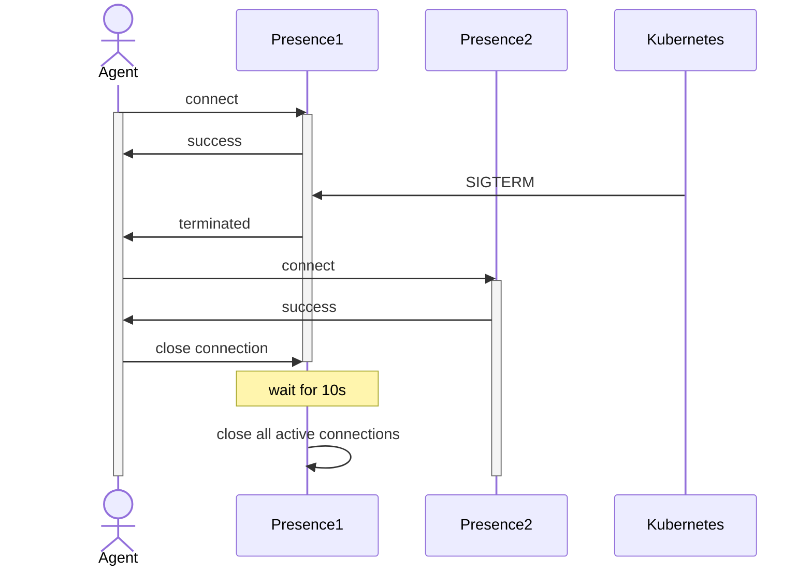

# Workflow

## Create session

```mermaid
sequenceDiagram
    actor Agent
    participant Presence
    participant Nats
    participant DB

    opt auth timeout
        Agent ->> Presence: ws connect
        activate Agent
        activate Presence
        Presence ->> Presence: wait for 10s
        Presence ->> Agent: close connection
        deactivate Agent
        deactivate Presence
    end

    Agent ->> Presence: ws connect
    activate Agent
    activate Presence
    Agent ->> Presence: connect request
    Presence ->> DB: create Agent session
    Presence ->> Nats: subscribe classrooms.<classroom_id>.*
    activate Nats
    Presence ->> Nats: agent.enter
    Presence ->> Agent: success

    loop Every 30s
        Presence->>Agent: ping
        Agent->>Presence: pong
    end

    Nats ->> Presence: new event
    Presence ->> Agent: new event

    opt pong timeout
        Presence->>Agent: ping
        Presence->>Presence: wait for 5s
        Presence->>Agent: close connection
    end

    deactivate Agent
    deactivate Presence
    deactivate Nats
```

## Close session

```mermaid
sequenceDiagram
    actor Agent
    participant Presence
    participant Nats
    participant DB

    Agent ->> Presence: close connection
    activate Presence
    Presence ->> Nats: agent.leave
    Presence ->> DB: move Agent session to history
    Presence ->> Presence: close connection for Agent
    deactivate Presence
```

## Replace session (on the same replica)

```mermaid
sequenceDiagram
    actor Agent1
    participant Presence
    participant DB
    actor Agent2

    Agent1 ->> Presence: connect
    activate Agent1
    activate Presence
    Presence ->> DB: create session for Agent1
    Presence ->> Agent1: success
    Agent2 ->> Presence: connect
    activate Agent2
    Presence ->> Agent1: replaced
    Presence ->> Presence: close connection for Agent1
    deactivate Agent1
    Presence ->> DB: get previous session for Agent2
    Presence ->> Agent2: success
    deactivate Agent2
    deactivate Presence
```

## Replace session (on another replica)

```mermaid
sequenceDiagram
    actor Agent1
    participant Presence
    participant DB
    actor Agent2

    Agent1 ->> Presence: connect
    activate Agent1
    activate Presence
    Presence ->> DB: create session for Agent1
    Presence ->> Agent1: success
    Agent2 ->> Presence: connect
    activate Agent2
    Presence ->> Agent1: replaced
    Presence ->> Presence: close connection for Agent1
    deactivate Agent1
    Presence ->> DB: move Agent1 session to history
    Presence ->> DB: create session for Agent2
    Presence ->> Agent2: success
    deactivate Agent2
    deactivate Presence
```

## Graceful shutdown

```mermaid
sequenceDiagram
    actor Agent
    participant Presence1
    participant Presence2
    participant Kubernetes

    Agent ->> Presence1: connect
    activate Agent
    activate Presence1
    Presence1 ->> Agent: success
    Kubernetes ->> Presence1: SIGTERM
    Presence1 ->> Agent: terminated
    Agent ->> Presence2: connect
    activate Presence2
    Presence2 ->> Agent: success
    Agent ->> Presence1: close connection
    deactivate Presence1
    note over Presence1: wait for 10s
    Presence1 ->> Presence1: close all active connections
    deactivate Presence2
    deactivate Agent
```
